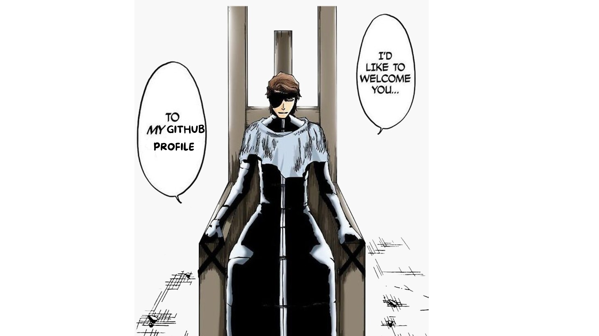

  

Nama saya Denielle Gunawan seorang lulusan SMK dengan jurusan RPL di SMK Gracia Bandung. 

---

## 🚀 Proyek Unggulanhttps://pages.github.com/

### 🍽️ [Koperasi Web App](https://github.com/Denielle-Gunawan/miniel-store)
### Sistem penjualan dan pengelolaan produk untuk koperasi sekolah.
##### Fitur utama:

- Manajemen produk lengkap: Tambah, Ubah, Hapus (CRUD) produk dan stok
- Sistem penjualan fleksibel dengan kemampuan input banyak produk sekaligus

- 

- Membuat data grafik penjualan

- User-friendly interface dengan kombinasi PHP, MySQL, HTML/CSS, dan JavaScript

##### Teknologi yang digunakan:
PHP, MySQL, HTML, CSS, JavaScript

---

## 🛠️ Skill dan Teknologi

- **Bahasa Pemrograman**: PHP, JavaScript, HTML, CSS, Laravel 11
- **Database**: MySQL
- **Framework / Tools**: Bootstrap, VS Code, Git, FileZilla
- **Desain & Multimedia**: Canva, CapCut, PowerPoint, Filmora

---

## 📚 Pengalaman

- **PKL di [CyberLabs](https://cyberlabs.co.id/) Bandung (2024)**  

---

## 🎯 Sedang Dipelajari

- Laravel & REST API
- Git Workflow & Deployment
- JavaScript
- excel
- Filmora

---

## 📫 Kontak

